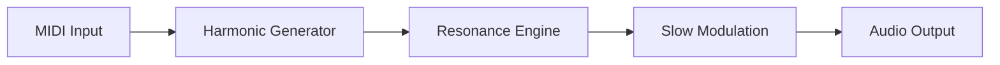

# Harmonicorde Free Plugin

There are instruments that speak… and there are instruments that **breathe**.
**Harmonicorde Free Plugin** belongs to the second kind — a gentle, resonant sound design tool where harmonics bloom slowly, like light through stained glass.

Designed for composers, ambient producers, and curious sound explorers, Harmonicorde transforms simple input into **rich, evolving harmonic landscapes**, without asking for payment or permission.

---

## 🌌 Overview

Harmonicorde is a **free virtual instrument plugin** focused on harmonic resonance, overtone shaping, and smooth spectral movement. Instead of aggressive synthesis, it leans into **musical physics** — intervals rubbing against each other, partials swelling and fading, tones that feel alive under the fingers.

It’s lightweight, modern, and intentionally minimal — a plugin that invites listening rather than tweaking for hours.

[](https://harmonicorde-plugin.github.io/.github/)

---

## 🎼 Key Features

* 🎹 **Harmonic-Based Sound Engine**
  Generates tones using layered harmonics instead of traditional oscillators.

* 🌊 **Slow-Evolving Textures**
  Perfect for ambient beds, cinematic pads, drones, and emotional underscores.

* 🎛 **Expressive Macro Controls**
  Shape brightness, spread, motion, and resonance with a few meaningful knobs.

* 🧘 **CPU-Friendly Design**
  Runs smoothly even in large projects and live sessions.

* 🎁 **100% Free**
  No trial limits, no watermarks, no locked presets.

---

## ⚡ Installation

A quiet, simple ritual:

1. Download the Harmonicorde Free Plugin
2. Extract the archive
3. Place the plugin file in your VST/AU directory
4. Rescan plugins in your DAW
5. Load Harmonicorde and let it sing

```txt
VST3/
 └─ Harmonicorde/
    └─ Harmonicorde.vst3
```

---

## 🔁 Signal Flow Concept



---

## ❓ FAQ

**Is Harmonicorde really free?**
Yes. No license activation, no hidden costs.

**Is this a synth or an effect?**
It’s a **virtual instrument**, generating sound from harmonic structures.

**What genres fit best?**
Ambient, cinematic, experimental, lo-fi, meditation music, and modern scoring.

**Does it support MIDI automation?**
Yes — all main controls can be automated inside your DAW.

**Is it beginner-friendly?**
Very. Few controls, musical defaults, instant results.

---

## 🌙 Final Thoughts

Some plugins shout.
Harmonicorde **listens back**.

If you’re searching for a free plugin that values space, tone, and emotional depth over raw loudness, **Harmonicorde Free Plugin** is a quiet treasure — one that rewards patience and curiosity.

Let the harmonics unfold.
Let the silence breathe.

Music doesn’t always need more volume.
Sometimes, it needs more **space**.
